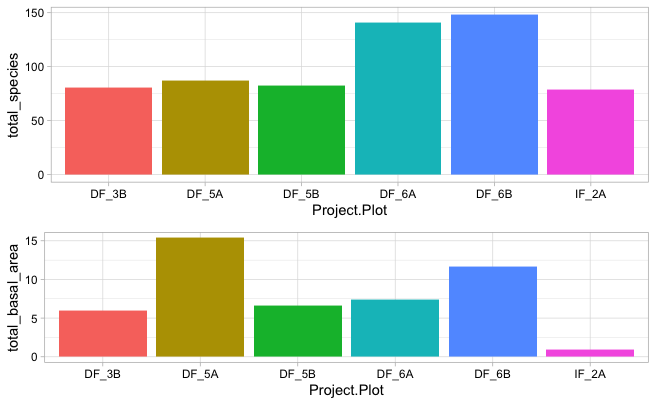

---
output:
  pdf_document:
    keep_tex: yes
    fig_caption: yes
    number_sections: yes
geometry: margin=2.54cm
title: "Effects of a Defaunation Gradient on Tropical Forest Structure in Ivindo National Park, Gabon"
subtitle: "https://github.com/israelgolden/GoldenGriffithsKnierMalinowski_ENV872_EDA_FinalProject"
author: "Tasha Griffiths, Israel Golden, Aubrey Knier, and Mishka Malinowski"
fontsize: 12pt
mainfont: Times New Roman
always_allow_html: true


---

\newpage
\tableofcontents 
\newpage
\listoftables 
\newpage
\listoffigures 
\newpage

```{r setup, include=FALSE}
# Set your working directory
setwd("../GoldenGriffithsKnierMalinowski_ENV872_EDA_FinalProject")

# Load your packages
library(tidyverse)
library(ggplot2)
library(sf)
library(leaflet)
library(mapview)
library(lubridate)
library(RColorBrewer)
library(raster)
library(formatR)
library(sf)
library(leaflet)
library(mapview)
library(webshot)
library(treemapify)
library(knitr)
library(kableExtra)
library(stringr)
library(cowplot)


# Set your ggplot theme
mytheme <- theme_light() +
  theme(axis.text = element_text(color = "black"), 
        legend.position = "right")
theme_set(mytheme)

# Load your datasets
raw.data <- read.csv("./Data/Raw/Data_USE_ME.csv")

# Load spatial files
Africa <- st_read('./Data/Spatial Files/Africa/afr_g2014_2013_0.shp')
Parks <- st_read('./Data/Spatial Files/Gabon/National Parks/NP_PresRes.shp')
Makokou <- read_csv('./Data/Spatial Files/Gabon/Makokou_Coordinates.csv')
Plots <- st_read('./Data/Spatial Files/Gabon/Plots/Plots with species/plots_with_species.shp')

#tables
raw.data.table <- read.csv('./Data/dataset_info.csv')
added.rows.table <- read.csv('./Data/added_rows.csv')

```

# **Background and Rationale**

Tropical forests throughout the world are experiencing changes in forest structure and ecosystem services due to increasing hunting pressure, resulting in plummeting animal populations^1^. This phenomenon, known as defaunation, has cascading effects throughout ecosystems due to the disruption of intricate plant-animal interactions that are responsible for shaping tropical forests^1^. Plant-animal interactions such as seed dispersal, seed predation, seedling trampling, herbivory, and nutrient translocation are necessary to shape forests. Through positive interactions such as the distribution of seeds and nutrients and antagonistic interactions such as herbivory and trampling - resulting in the opening up of the understory, plant-animal interactions create opportunities for a variety of species to succeed in the forest and increase plant diversity, richness, and ecosystem services^2^. For example,95% of the trees in the Afrotropical forests of LuiKotale in the Congo Basin depend on animals for dispersal, demonstrating the necessity of plant-animal interactions in these systems^3^. The alteration or loss of faunal communities in tropical forests has led to "Empty Forest Syndrome", where a forest appears to be intact, but the animal community is so depleted or non-existent that the forest no longer functions as it did. These changes result in alterations to ecosystem services, like carbon storage^4^. 

As defaunation continues to increase globally, there is little understanding of the long-term effects of defaunation on tropical forest diversity and ecosystem services. Tropical forests are responsible for sequestering ~40% of the world's aboveground carbon^4^. Therefore, the impact of defaunation on tropical forests may have detrimental effects for global carbon storage and climate change projections. Further research is necessary to understand the intricate interactions between defaunation, tropical forests, and ecosystem services to illuminate these relationships and advocate for policy changes and resource management. However, it is essential to highlight that the underlying causes of defaunation are top-down driven by the global economy, government regulations and incentives, access to income and livelihoods,and ultimately quality of life. 

# Study Overview and Site 

Gabon, the second most forested country in the world, is located in central western Africa and provides an ideal study site for understanding the effects of defaunation on tropical forests (Figure 1).  The Afrotropical forests extending throughout Gabon are one of the last strongholds for several endemic species including the forest elephant *(Loxodonta cyclotis)*. Ivindo National Park, one of 14 national parks and presidential reserves, lies on the outskirts of several villages and provides an excellent location to understand the interactions of hunting pressure within tropical forests (Figure 2). A study by Koerner et al. in 2016 in this area described the existence of a defaunation gradient radiating away from the villages and into Ivindo national park. The results of the study showed that distance from villages could be used as a proxy for defauntion and that every 10 kilometers traveled away from villages mammal richness would increase by 1.5 species^5^. 

In 2020 a project was started by the Poulsen Ecology Lab to establish forest plots along the defaunation gradient to further explore the relationship between forest structure and defaunation. As of 2022, 10 sites with a paired-plot design have been established (plots, n = 20). Within the twenty 50 x 50m plots, all trees above 1.5 meters in height have been tagged and measured. In six of these plots, tree species have also been identified. Our analyses will focus on the complete data from this subset of six plots(Figure 3). Makokou, the largest town in this area also considered a regional capital, is indicated on the map to demonstrate hunting pressure and indicate that the most defaunated plots are those closest to Makokou while intact forests are farthest from Makokou (Figure 3). Due to the scale of the map it appears there are only 4 plots instead of 6, this is because of the paired - plot design at the sites. Our dataset includes the paired plots DF 5A & DF 5B and DF 6A & DF 6B. These pairs of plots are only separated by 100m, therefore the points indicating the plots overlap on the below map (Figure 3). 


```{r creating map of Africa, include=F}

#Determine coordinate reference system & explore columns
st_crs(Africa)#WGS 84
colnames(Africa)

#Map of Africa
mapView(Africa,zcol = "ADM0_NAME")

```

```{r Map of Gabon, fig.cap="Map of Africa with Gabon Indicated", echo=F, eval=T}
#Making Gabon sf
Gabon <- Africa %>%
  filter(ADM0_NAME == 'Gabon')

#Maping Gabon
#mapview(Africa, col.regions = "mediumpurple3")+ 
  #mapview(Gabon, col.regions = "springgreen")

ggplot() +
  geom_sf(data = Africa, aes(fill = "A"), color= 'black', alpha = 0.5, show.legend = "polygon", inherit.aes = F) + 
  geom_sf(data = Gabon,aes(fill = "B"), color='darkgreen', alpha = 0.85, show.legend = "polygon", inherit.aes = F)+
  scale_fill_manual(values = c("A" = "mediumpurple3", "B" = "palegreen3"),
                    labels = c("Continental Africa", "Gabon"),
                    name = "Legend")

```

```{r set up Detailed Map of Gabon with parks, include=F}
st_crs(Parks) #Gtm_Gabon
colnames(Parks)

#change crs to WGS 84
National_Parks <- st_transform(Parks, "+proj=longlat +datum=WGS84")
st_crs(National_Parks)

#Getting Ivindo National Park by itself
Ivindo_NP <- National_Parks %>%
  filter(NOM == "IVINDO")

mapview(Gabon, col.regions = "palegreen1")+
  mapview(National_Parks, col.region = "palegreen3")+
  mapview(Ivindo_NP, col.region = "darkgreen", lwd = 1.5, color = "black")

``` 

```{r Detailed Map of Gabon with parks, fig.cap="Gabon's National Parks", echo=F, eval=T}

#Map with ggplot
ggplot() +
  geom_sf(data = Gabon, aes(fill = "A"), color='darkgreen', size = 0.6, alpha = 0.6, show.legend = "polygon", inherit.aes = F) +
  geom_sf(data = National_Parks, aes(fill = "B"), color = 'palegreen3', alpha = 0.7, show.legend = "polygon", inherit.aes = F)+
  geom_sf(data = Ivindo_NP, aes(fill = "C"), color='black', size=0.5, alpha = 0.7, show.legend = "polygon", inherit.aes = F) + 
    scale_fill_manual(values = c("A" = "palegreen1", "B" = "palegreen3", "C" = "darkgreen"),
                    labels = c("Gabon", "National Parks", "Ivindo National Park"), name = "Legend")

``` 

```{r set up Map of Ivindo with plots, include=F}

st_crs(Makokou)
Makokou <- Makokou %>%
  st_as_sf(coords = c('Longitude', 'Latitude'), crs = "+proj=longlat +datum=WGS84")
Makokou_WGS84 <- st_transform(Makokou, "+proj=longlat +datum=WGS84")
st_crs(Plots) #WGS 84
colnames(Plots)
Makokou_WGS84 <- st_transform(Makokou, "+proj=longlat +datum=WGS84")

#CRS
st_crs(Plots) #WGS 84
colnames(Plots)

#Map Gabon with Parks and Plots
mapviewPalette(name = "mapviewVectorColors")

mapview(Ivindo_NP, col.region = "palegreen2", lwd = 1, color = "black", alpha.regions = 0.5)+
  mapview(Plots, zcol = "Plot_Name", col.region = c("orangered","magenta","red","gold","orange","yellow"), cex = 4, alpha.regions = 0.70)+
  mapview(Makokou, col.region = "black", cex = 4, alpha.regions = 0.95)

```

```{r Map of Ivindo with plots, fig.cap="Forest Plots along a Defaunation Gradient in Ivindo National Park, Gabon", echo=F, eval=T}


ggplot() +
  geom_sf(data = Ivindo_NP, aes(fill = "A"), color='black', size = 0.5, alpha = 0.65, show.legend = "polygon", inherit.aes = F) +
  geom_sf(data = Plots, aes(color = "B"), size = 1.5, alpha = 0.5, show.legend = "point", inherit.aes = F)+
  geom_sf(data = Makokou, aes(color = "C"), size= 2, alpha = 0.7, show.legend = "point", inherit.aes = F) + 
    scale_fill_manual(values = c("A" = "palegreen2"),
                    labels = c("Ivindo National Park"), name = "Legend",
guide = guide_legend(override.aes = list(shape = NA)))+
  scale_color_manual(values = c("B" = "red", "C" = "black"), 
                     labels = c("Plots", "Makokou"),
                     guide = guide_legend(override.aes = list(linetype = c("blank"))))

```

\newpage

# Research Questions
**Overarching Research Question:**
How does defaunation affect forest structure and composition in Ivindo National Park, Gabon? 

* _Research Question 1:_ Does Diameter at Breast Height (DBH) change along a defaunation gradient?
* _Research Question 2:_ Are there differences in Basal Area across a defaunation gradient?
* _Research Question 3:_ Does species composition change along a defaunation gradient?

\newpage

# Data

## Dataset Information

This dataset is provided by the Pouslen Tropical Ecology Lab here at Duke. A summary of the variables, variable descriptions, units, and ranges are found in Table 1. The dimensions of the raw dataset are below:
```{r dataset info, echo=F, eval=T}
dim(raw.data)
```

```{r, echo=F, eval=T}
kable(raw.data.table, caption="Raw Dataset Information") %>% 
  kable_styling(latex_options="scale_down") %>%
  kable_styling(latex_options = "HOLD_position")
```

\newpage

## Data cleaning

With such a large dataset, data cleaning and wrangling was an essential process for creating a manageable dataset that was relevant for answering our research questions. First, we subset our selected six plots for our analysis:
```{r load and subset data, include=F}
#DATA CLEANING
#using plots: "DF3B", "DF5A", "DF5B", "DF6A", "DF6B" and "IF2A"

#exploring groups within project and plot columns
unique(raw.data$Project)
unique(raw.data$Plot)

colnames(raw.data)

data.plot.subset <- raw.data %>%
  unite("Project.Plot", Project:Plot, remove=F) %>%
    filter(Project.Plot %in% c("DF_3B", "DF_5A", "DF_5B", "DF_6A", "DF_6B", "IF_2A"))
```

```{r subset plot names, echo=F, eval=T}
#check row names of Project.Plot
unique(data.plot.subset$Project.Plot)
```
These plots were chosen out of the total 20 plots because they were the only ones that had species identifications attached to samples, which was needed for our investigation of how defaunation affects species composition. 

Next, we only selected columns that contained variables of interest:

```{r, include=F}
#subset columns/variables we want
colnames(data.plot.subset)
data.subset <- data.plot.subset %>%
  dplyr::select(Project.Plot, Plant_tag, DBH..mm., Height..meters., Type_Field, ID)

colnames(data.subset) = c("Project.Plot", "Plant_tag", "DBH_mm", "Height_m", "Veg_Type", "ID")
```

```{r column/variables, echo=F, eval=T}
colnames(data.subset)
```


We removed absent or unreasonable values from the dataset. This involved simply removing blank cells or "NAs", as well as measurements that were likely incorrect, probably as a result of improper unit conversions. Additionally, we improved uniformity in the dataset by removing samples that had a height less than 1.5m and lianas. This was because not all plots measured individuals smaller than 1.5m, and height measurements for lianas are less reliable, so we decided to only analyze trees. We also found some instances in our data where samples were relatively tall yet had a very small DBH. Since this likely due to a data collection or entry error, we removed any samples that had a DBH less than 1mm and a height above 1.5m to improve accuracy.

```{r cleaning dataset & columns, include=F}
#remove data we don't want to use or is missing
data.subset <- data.subset %>%
  na.omit(DBH_mm)%>% #remove DBH with no values
  filter(Height_m > 1.49) %>% #remove specimens wit height < 1.5
  filter(Veg_Type != "Liana") %>% #remove lianas
      filter(ID != "#N/A") %>% #remove species ID called "#N/A"
      filter(ID != "") %>% #remove species ID with ""
      filter(!grepl("ECH", ID))
  
#check through columns
#Plant_tag
summary(data.subset$Plant_tag)

#DBH
summary(data.subset$DBH_mm)
#max appears reasonable!
#min seems much too small - explore further 
nrow(data.subset[data.subset$DBH_mm == 0.10,]) 
which(data.subset$DBH_mm == 0.10)
data.subset <- data.subset %>% 
  filter(DBH_mm > 1.0) # values below 1 were unreasonable for a height >1.5, most likely a unit error and the raw data will have to be examined and re-entered 
```

```{r, include=F}
#Height 
summary(data.subset$Height_m)

#Veg_Type
summary(data.subset$Veg_Type)
unique(data.subset$Veg_Type)
data.subset$Veg_Type[data.subset$Veg_Type %in% c("tree","TREE")] <- "Tree"
data.subset$Veg_Type <- ifelse (data.subset$Height_m < 2.0, "Sapling", "Tree")

```

We also added in variables to support our research questions and analyses. We created two new columns: "Status" referring to defaunated or intact study plots and "Distance_km" from Makokou (Table 2). The categorical variable, "Status", will help with data visualization, and the "Distance_km" variable will be used as a proxy from the defaunation gradient in our analyses. A sample of our cleaned dataset is shown in Table 3.

```{r, echo=F, eval=T}
kable(added.rows.table, caption="Added Variables to Dataset") %>% 
  kable_styling(latex_options="scale_down") %>%
  kable_styling(latex_options = "HOLD_position")
```

``` {r add new columns, include=F}
#Add Status column - defaunated or intact forest
data.subset <- data.subset %>% 
  mutate(Status = Project.Plot)
unique(data.subset$Status)
data.subset$Status[data.subset$Status %in% c("DF_3B","DF_5A", "DF_5B", "DF_6A", "DF_6B")] <- "Defaunated"
data.subset$Status[data.subset$Status %in% c("IF_2A")] <- "Intact"
unique(data.subset$Status)

#Add distance from village column 
data.subset <- data.subset %>% 
  mutate(Distance_km = Project.Plot)
data.subset$Distance_km[data.subset$Distance_km %in% c("DF_3B")] <- "20.195"
data.subset$Distance_km[data.subset$Distance_km %in% c("DF_5A")] <- "8.177"
data.subset$Distance_km[data.subset$Distance_km %in% c("DF_5B")] <- "9.323"
data.subset$Distance_km[data.subset$Distance_km %in% c("DF_6A")] <- "23.839"
data.subset$Distance_km[data.subset$Distance_km %in% c("DF_6B")] <- "23.839"
data.subset$Distance_km[data.subset$Distance_km %in% c("IF_2A")] <- "40.224"
data.subset$Distance_km <- as.numeric(data.subset$Distance_km)
class(data.subset$Distance_km)

#Overall summary 
summary(data.subset)
dim(data.subset)
```


```{r, head/columns, echo=F, eval=T}
kable(head(data.subset), caption="Head of Cleaned Dataset")  %>% 
  kable_styling(latex_options="scale_down") %>%
  kable_styling(latex_options = "HOLD_position")
```

Accidental misspellings are common in datasets such as this with thousands of manual entries of complex Latin species names. This is a concern because two samples that are supposed to be the same species, but have different spellings, will not be identified as the same species in our analyses. By looking at a list of the unique species names in the dataset, we found this to be the case in several instances. Identifying these errors and correcting them was quite labor intensive and can only be completed with the human eye and personal judgment as to what names are meant to be the same. Before cleaning the species names, there were 349 "species"; after correcting for spelling mistakes, there were only 323 species. This means that 26 "species" were falsely identified prior to data cleaning.

```{r, species data cleaning, include=F}

#Species IDs
sort(unique(data.subset$ID))

#remove more lianas that were input into ID column
data.subset <- data.subset %>%
  filter(ID != "Liana undetermined",  
         ID != "Liane sp 100",
         ID != "Liane sp 130",
         ID != "Liane sp 130",
         ID != "Liane sp 18", 
         ID != "Liane sp 20",
         ID != "Liane 1",
         ID != "Liane sp 1",
         ID != "Liane sp 17",
         ID != "Liane sp 21",
          ID != "liane sp 26",
         ID !=  "Liane sp 30",
         ID != "Liane sp 40",
         ID != "Liane sp 7",
         ID != "Liane sp 71",
         ID != "Liane sp 75",
          ID != "Liane sp 91",
         ID != "Liane sp 96",
         ID != "Liane A" ,
          ID != "Liane sp 12",
         ID != "Liane sp 19" ,
         ID !="Liane sp 23",
         ID != "Liane sp 26",
         ID != "Liane sp 36",
         ID != "Liane sp 6",
          ID != "Liane sp 70",
         ID != "Liane sp 74",
         ID != "Liane sp 80",
         ID != "Liane sp 92",
         ID != "Liane undetermined"
         )

#remove "undetermined" and "tag removed" species IDs
data.subset <- data.subset %>%
  filter(ID != "undetermined" ,
         ID != "Undetermined",
         ID !=  "Undetermined sp 10",
         ID != "Undetermined sp 20",
         ID != "Undetermined sp 3",
         ID != "Undetermined sp 30",
         ID != "Undetermined sp 7",
         ID != "Tree undetermined",
         ID != "tree undetermined",
         ID != "tag removed",
          ID != "Tag removed" )

#check that all lianas, "undetermined"s, and "tag removed" are gone
sort(unique(data.subset$ID))
length(unique(data.subset$ID))
    
#correcting spelling mistakes that make the same species appear separate in the code
data.subset$ID[data.subset$ID %in% c("Afrostyrax lepidophloeus")] <- "Afrostyrax lepidophyllus"
data.subset$ID[data.subset$ID %in% c("Agellae paradoxa")] <- "Agelaea paradoxa"
data.subset$ID[data.subset$ID %in% c("Xylopia quintesi")] <- "Xylopia quintasii"
data.subset$ID[data.subset$ID %in% c("Tricoscypha acuminata")] <- "Trichoscypha acuminata"
data.subset$ID[data.subset$ID %in% c("Tricoscypha abut")] <- "Trichoscypha abut"
data.subset$ID[data.subset$ID %in% c("trichilia sp 1")] <- "Trichilia sp 1"
data.subset$ID[data.subset$ID %in% c("Tessmania africana")] <- "Tessmannia africana"
data.subset$ID[data.subset$ID %in% c("Strombosiopsis tetranda")] <- "Strombosiopsis tetrandra"
data.subset$ID[data.subset$ID %in% c("salacia sp 1")] <- "Salacia sp 1"
data.subset$ID[data.subset$ID %in% c("Pseudoposopis giletti")] <- "Pseudoprosopis gilletti"
data.subset$ID[data.subset$ID %in% c("Pentaclethra aetveldiana")] <- "Pentaclethra eetveldeana"
data.subset$ID[data.subset$ID %in% c("Pausinystalia Johimbe")] <- "Pausinystalia johimbe"
data.subset$ID[data.subset$ID %in% c("Napoleona vogelei")] <- "Napoleona vogellei"
data.subset$ID[data.subset$ID %in% c("Klaineanthus gaboni")] <- "Klaineanthus gabonii"
data.subset$ID[data.subset$ID %in% c("Greenwaydendron suavolens")] <- "Greenwayodendron suaveolens"
data.subset$ID[data.subset$ID %in% c("Garcinia afzelii")] <- "Garcinia afzelli"
data.subset$ID[data.subset$ID %in% c("Drypetes gosseweileri")] <- "Drypetes gossweileri"
data.subset$ID[data.subset$ID %in% c("Dismonanthus bentanianus")] <- "Distemonanthus benthamianus"
data.subset$ID[data.subset$ID %in% c("diospyros sp 5")] <- "Diospyros sp 5" 
data.subset$ID[data.subset$ID %in% c("diospyros sp 6")] <- "Diospyros sp 6" 
data.subset$ID[data.subset$ID %in% c("Diogua zenkeri")] <- "Diogoa zenkeri"
data.subset$ID[data.subset$ID %in% c("Dialium denclagei")] <- "Dialium dinklagei" 
data.subset$ID[data.subset$ID %in% c("Dialium bipendensis")] <- "Dialium bipindense" 
data.subset$ID[data.subset$ID %in% c("Dachriodes kleiniana")] <- "Dacryodes klaineana"
data.subset$ID[data.subset$ID %in% c("Dachriodes butineri")] <- "Dacryodes buettneri"
data.subset$ID[data.subset$ID %in% c("cola sp 1")] <- "Cola sp 1" 
data.subset$ID[data.subset$ID %in% c("Coelocaryron preussii")] <- "Coelocaryon preussii"
data.subset$ID[data.subset$ID %in% c("Chytranthus talboti")] <- "Chytranthus talbotii"
data.subset$ID[data.subset$ID %in% c("Agelaea paradoxa" )] <- "Agellae paradoxa" 
```

```{r export & read in cleaned dataset, include=F}
write.csv(data.subset, 
          file = "./Data/Processed/Cleaned_Gabon_Forest_Plot_Data.csv")

clean.data <- read.csv("./Data/Processed/Cleaned_Gabon_Forest_Plot_Data.csv", 
                     stringsAsFactors = TRUE)

colnames(clean.data)

clean.data <- clean.data %>%
  dplyr::select(-X)

```

The dimensions of the processed, clean dataset are as follows:
```{r explore cleaned data, echo=F, eval=T}
dim(clean.data)
```

\newpage

# Methods

## Research Question 1

*Does Diameter at Breast Height (DBH) change along a defaunation gradient?*

We began by analyzing our data through an examination of how DBH distribution (size classes) changes along the defaunation gradient. Diameter at Breast Height (DBH) is a measurement of the circumference of a tree trunk 1.37 meters or 4.5 feet above the ground. DBH may be used to understand the effect of defaunation within a stand. For example, a high frequency of thinner trees would indicate an earlier successional pattern and a higher frequency of larger/wider trees a more mature stand with less disturbance. DBH was taken in millimeters for all trees above 1.5m in height within the plots. We used a ggplot visualization and histogram in order to understand the frequency and size distribution of DBH of individual trees within each of the six plot sites. We added all sites with a facet wrap in order to directly compare distribution with the same scale. The x-axis is DBH in mm, with default bin sizes and the y-axis is frequency of occurrence. The sites were also ordered in distance from Makokou with sites EF_5A and EF_5B being the closest and IF_2A being the farthest away.

## Research Question 2

*Are there differences in Basal Area across a defaunation gradient?*

Next, we used the cleaned data to generate summaries of stand characteristics at the plot level. These characteristics included the total basal area of each site, the standard deviation of basal area among individual trees, the species richness of each site, and the basal area per hectare of each plot. Basal area is the cross-sectional area of a tree at breast height. By summing basal area for a plot, the result provides a means of understanding the tree density of a stand. Basal area has implications for forest health, competition, and growth dynamics. Basal area was calculated by mutating the DBH column to reflect the basal area of each observation. DBH can be converted to basal area - in terms of square cm - from mm with the formula BA = ((pi*d^2^)/4)/100. The basal area for each site was then summed and converted to square meters for visualization. These summary values allowed for comparison of forest structure and species richness between project plots. 

## Research Question 3

*Does species composition change along a defaunation gradient?*

We then calculated and visualized the proportion of basal area that each genera contributed to overall basal area for each plot. Unique species were too numerous for effective visualization so we used unique genera to provide a visual representation of the diversity of tree lineages at each plot. This was accomplished by extracting the first word (i.e., the genus) from the species ID column to create a genus column. The basal area for each genus at each plot was then summed and visualized alongside the basal area of other genera to show the overall contribution of each genus to the plot’s basal area. 

## Research Question Synthesis

Finally, we sought to uncover a relationship between distance from Makokou and forest structure and species richness with a linear model. The model describes basal area per hectare as a function of distance from Makokou and total number of unique species for each plot. Distance from Makokou serves as a proxy for position along the defaunation gradient where shorter distances are assumed to be more defaunated and farther distances are considered to be intact, faunated forest. The null hypothesis of both of these models is that there is no relationship between distance from Makokou (i.e., position along the defaunation gradient). Alternatively, if an explanatory variable in the model is deemed significant, it could provide some insight into how the defaunation gradient affects either basal area or species richness.

# Results

## Research Question 1

*Does Diameter at Breast Height (DBH) change along a defaunation gradient?*

The below visualizations indicate that all sites have a much higher frequency of thinner trees - smaller than 150mm in DBH (Figures 4 & 5). However, upon adjusting the x-axis scale, it is easier to see a full histogram of the plots. These visualizations led to two key findings:

1. Plots closer to the city have higher overall frequencies and higher frequencies of large DBH trees. For example, plots DF_5A and DF_5B have higher frequencies of larger trees.

2. Plots farther away from the city, such as IF_2A has fewer overall trees and the trees that are present are much thinner in DBH. 

Since DBH for all of the plots was skewed to the smaller size class, this tends to indicate more defaunation in all plots. Also it was unexpected to have larger DBH trees closer to town and thinner trees in the single 'intact' forest plot. One would expect the opposite to be true with more defaunation close to the town and wider trees farthest away. One potential explanation for this may be the existence of remaining old growth trees in these plots due to the short time scale for defaunation in this area (approximately the last 50 years). Over a greater time period the large trees would senesce and die and not be replaced due to lack of seed dispersers.


```{r DBH graphs, include=F}

#basic visualization
DBHbyplot <- ggplot(clean.data, 
                    aes(x = Project.Plot, y = DBH_mm, color = Project.Plot)) +
  geom_point() + xlab("Project Plot") + ylab( "DBH in Milimeter")
print(DBHbyplot)


#checking distance  
ggplot(clean.data, aes(x = Project.Plot, y = Distance_km)) + geom_point()
#order by closest to city - DF_5A, DF_5B, DF_3B, DF_6A, DF_6B, IF_2A

ordereddata <- arrange(clean.data, Distance_km)

#wrangle data for each plotsite
DF_5A_Data <- subset(clean.data, Project.Plot== "DF_5A")
DF_5B_Data <- subset(clean.data, Project.Plot== "DF_5B")
DF_3B_Data <- subset(clean.data, Project.Plot== "DF_3B")
DF_6A_Data <- subset(clean.data, Project.Plot== "DF_6A")
DF_6B_Data <- subset(clean.data, Project.Plot== "DF_6B")
IF_2A_Data <- subset(clean.data, Project.Plot== "IF_2A")

#individual historgram full data
plot_DF_5A <- ggplot(DF_5A_Data, 
                    aes(x = DBH_mm, color=Project.Plot)) +
  geom_histogram(color= "orange") + xlab("DBH in mm") + ylab( "Frequency") + 
  ggtitle("DBH of Site DF_5A")
print(plot_DF_5A)

plot_IF_2A <- ggplot(IF_2A_Data, 
                    aes(x = DBH_mm, color=Project.Plot)) +
  geom_histogram(color = "pink") + xlab("DBH in mm") + ylab( "Frequency") + 
  ggtitle("DBH of Site IF_2A")
print(plot_IF_2A)


#individual histogram limited DBH scale
plot_DF_5A_limited <- ggplot(DF_5A_Data, 
                    aes(x = DBH_mm)) +
  geom_histogram() + xlim(0,550) +
  xlab("DBH in mm") + ylab( "Frequency") + ggtitle("DBH of Site DF_5A")
print(plot_DF_5A_limited)


#histogram of all sites
allsitesbyDBH <- ggplot(clean.data, aes(x = DBH_mm, color = Project.Plot)) +
  geom_histogram() + facet_wrap(vars(Project.Plot)) +
  xlab("DBH in mm") + ylab("Frequency") + ggtitle("DBH across Sites")
print(allsitesbyDBH)

allsitesbyDBH_limitedx <- ggplot(clean.data, aes(x = DBH_mm, color = Project.Plot)) +
  geom_histogram() + facet_wrap(vars(Project.Plot)) + xlim(0,150) +
  xlab("DBH in mm") + ylab("Frequency") + ggtitle("DBH across Sites")
print(allsitesbyDBH_limitedx)


#re-order facet_wrap by distance from city
allsitesordered <- ggplot(transform(clean.data, 
                                    Project.Plot=factor(Project.Plot, 
                                                        levels=c("DF_5A", 
                                                                 "DF_5B", 
                                                                 "DF_3B", 
                                                                 "DF_6A", 
                                                                 "DF_6B", 
                                                                 "IF_2A")))) + 
  geom_histogram(aes(x = DBH_mm, color = Project.Plot)) + 
  facet_wrap(vars(Project.Plot)) +
  xlab("DBH in mm") + ylab("Frequency") + ggtitle("DBH across Sites")
print(allsitesordered)


allsitesordered_limitedx <- ggplot(transform(clean.data, 
                                             Project.Plot=factor(Project.Plot, 
                                                                 levels=c("DF_5A", 
                                                                          "DF_5B", 
                                                                          "DF_3B", 
                                                                          "DF_6A", 
                                                                          "DF_6B", 
                                                                          "IF_2A")))) +
  geom_histogram(aes(x = DBH_mm, color = Project.Plot)) + 
  facet_wrap(vars(Project.Plot)) + xlim(0,150) +
  xlab("DBH in mm") + ylab("Frequency")
```

```{r, fig.cap="Distribution of DBH Size Classes per Plot", echo=F, eval=T, message=F, warning=F}
print(allsitesordered_limitedx)
```

```{r, include=F}
#otherways to determine differences in DBH per site
summary(DF_5A_Data$DBH_mm)
summary (IF_2A_Data$DBH_mm)


DBHstats <- ggplot(clean.data, 
                    aes(x = DBH_mm, color = Project.Plot)) +
  geom_bar() + xlim(0, 500) +
  xlab("DBH") + ylab( "Frequency")

```

```{r, fig.cap="Distribution of DBH Size Classes Across Plots", echo=F, eval=T, message=F, warning=F}
print(DBHstats)
```


```{r LM data preparation, include=F}

# Analysis

##GLMs

# derive basal area from tree DBH in terms of square cm
treedata <- mutate(clean.data, basal_area_cm = (((DBH_mm^2)*pi)/4)/100)

#summarize basal area by Project Plot
#Basal area will be in terms of square meters
SiteSummaries <- treedata %>%
  group_by(Project.Plot) %>%
  summarise(Mean_dist = mean(Distance_km),
            total_basal_area = sum(basal_area_cm),
            StDev_basal_area = sd(basal_area_cm),
            total_species = n_distinct(ID)) %>%
  mutate(total_basal_area = (total_basal_area/10000)) %>%
  mutate(basal_area_per_ha = (total_basal_area/0.25))

# Investigate basal area by species at each site
# DF_5A
DF_5A_basalarea <- treedata %>%
  filter(treedata$Project.Plot == 'DF_5A') %>%
  group_by(ID) %>%
  summarise(species_basal_area = sum(basal_area_cm),
            number_of_trees = n(),
            mean_basal_area = mean(basal_area_cm)) %>%
  mutate(plot_id = 'DF_5A')


#DF_5B
DF_5B_basalarea <- treedata %>%
  filter(treedata$Project.Plot == 'DF_5B') %>%
  group_by(ID) %>%
  summarise(species_basal_area = sum(basal_area_cm),
            number_of_trees = n(),
            mean_basal_area = mean(basal_area_cm)) %>%
  mutate(plot_id = 'DF_5B')
  
#DF_3B
DF_3B_basalarea <- treedata %>%
  filter(treedata$Project.Plot == 'DF_3B') %>%
  group_by(ID) %>%
  summarise(species_basal_area = sum(basal_area_cm),
            number_of_trees = n(),
            mean_basal_area = mean(basal_area_cm)) %>%
  mutate(plot_id = 'DF_3B')

#DF_6A
DF_6A_basalarea <- treedata %>%
  filter(treedata$Project.Plot == 'DF_6A') %>%
  group_by(ID) %>%
  summarise(species_basal_area = sum(basal_area_cm),
            number_of_trees = n(),
            mean_basal_area = mean(basal_area_cm)) %>%
  mutate(plot_id = 'DF_6A')

#DF_6B
DF_6B_basalarea <- treedata %>%
  filter(treedata$Project.Plot == 'DF_6B') %>%
  group_by(ID) %>%
  summarise(species_basal_area = sum(basal_area_cm),
            number_of_trees = n(),
            mean_basal_area = mean(basal_area_cm)) %>%
  mutate(plot_id = 'DF_6B')

#IF_2A
IF_2A_basalarea <- treedata %>%
  filter(treedata$Project.Plot == 'IF_2A') %>%
  group_by(ID) %>%
  summarise(species_basal_area = sum(basal_area_cm),
            number_of_trees = n(),
            mean_basal_area = mean(basal_area_cm)) %>%
  mutate(plot_id = 'IF_2A')

species_by_site_df <- rbind(DF_3B_basalarea, DF_5A_basalarea, DF_5B_basalarea, 
                         DF_6A_basalarea, DF_6B_basalarea, IF_2A_basalarea)

library(stringr)

species_by_site_df$genus <- word(species_by_site_df$ID, 1)

```

```{r GLM data visualization, include=F}
# What is the distribution of basal area in square cm for each tree by site?

ggplot(treedata, aes(x = basal_area_cm, fill = Project.Plot)) + 
  geom_histogram(bins = 40) +
  xlim(0,50) +
  facet_wrap(treedata$Project.Plot) +
  labs(title = "Basal area distribution of study plots")
```

```{r, include=F}
species_by_plot <- ggplot(data=SiteSummaries, aes(x=Project.Plot, y=total_species, fill = Project.Plot)) +
  geom_bar(stat="identity") +
  theme(legend.position="none")

basal_area_by_plot <- ggplot(data=SiteSummaries, aes(x=Project.Plot, y=total_basal_area, fill = Project.Plot)) +
  geom_bar(stat="identity") +
  theme(legend.position="none")

library(cowplot)
```

## Research Question 2

*Are there differences in Basal Area across a defaunation gradient?*

Results of this exploratory analysis reveal differences in basal area and species richness for each plot. As basal area is a function of DBH, the distribution of basal area across plots mirrored that of its DBH distribution (Figure 4). This result affirms that trees at each site are mostly small with few trees above 10 cm2 of basal area and even fewer - if any - above 20 cm^2^. Species richness values ranged between 79 and 148; but four out of the six plots had a mean species richness of 85 (Figure 6). The two plots with the greatest species richness were DF_6A and DF_6B which had 141 and 148 unique species respectively. Total basal area at each plot ranged from 0.92 m^2^  to 15.35 m^2^. The plots with the greatest basal area were plots DF_5A and DF_6B which had 15.35m^2^ and 11.66 m^2^ respectively. Interestingly, the intact forest plot , IF_2A, had the lowest basal area at 0.92 m^2^. Given IF_2A's high species richness but low basal area, these results seem to suggest that IF_2A has many small trees, but few large ones. Overall, there does not appear to be a strong relationship between number of tree species and basal area.
```{r, fig.cap = "Species Richness and Basal Area by Plot", echo=F, eval=T, message=F, warning=F, out.width="95%"}

fig6_plot <- plot_grid(species_by_plot, basal_area_by_plot, nrow = 2, align = 'h', rel_heights = c(1.25, 1))

#we tried to use fig.cap for fig6_plot, but it wouldn't recognize it as a figure since we were using plot_grid, so we had to read it in as a .png. sorry!


```

## Research Question 3

*Does species composition change along a defaunation gradient?*

By combining genus richness with basal area into treeplots, we are able to compare the abundance of tree genera at each plot. Specifically, treeplots allow us to visually represent the contribution of basal area by each genus at each plot. No single tree genera was overwhelmingly dominant across all plots. Rather, each plot had one to three genera that contributed a plurality of the basal area. Plot DF_6A, which had the greatest number of unique species, was dominated by Beilschmiedia (14% of basal area or 10,438 cm^2^), Petersianthus (9% of basal area or 6,268 cm^2^), and Celtis (8.5% of basal area or 5,986 cm^2^) species (Figure 7). Meanwhile, IF_2A, which had the smallest amount of basal area, was dominated by a single genus: Thomandersia (56% of basal area or 5202 cm^2^) (Figure 8). Overall, species composition did change along the defaunation gradient, but there were no predictable or observable trends that dictated these changes. 

```{r DF_3B, include=F}
# Genus basal area at each site
#install.packages("treemapify")

# start by creating a new data frame with basal area summaries by genus (basal are in square meters per hectare)
DF_3B_basalarea$genus <- word(DF_3B_basalarea$ID, 1)
DF_3B_genus_summary <- DF_3B_basalarea %>%
  group_by(genus) %>%
  summarise(genus_basal_area = sum(species_basal_area))

# Plot with a treemap showing the area each genus takes up at each site, extrapolated to a hectare
ggplot(DF_3B_genus_summary, aes(area = genus_basal_area, fill = genus_basal_area, label = genus)) +
  geom_treemap() +
  geom_treemap_text(colour = "white",
                    place = "centre",
                    size = 15,
                    grow = TRUE) +
  scale_fill_viridis_c(option = "turbo")
```

```{r DF_5A, include=F}
#DF_5A
DF_5A_basalarea$genus <- word(DF_5A_basalarea$ID, 1)
DF_5A_genus_summary <- DF_5A_basalarea %>%
  group_by(genus) %>%
  summarise(genus_basal_area = sum(species_basal_area))

ggplot(DF_5A_genus_summary, aes(area = genus_basal_area, fill = genus_basal_area, label = genus)) +
  geom_treemap() +
  geom_treemap_text(colour = "white",
                    place = "centre",
                    size = 15,
                    grow = TRUE) +
  scale_fill_viridis_c(option = "turbo")
```

```{r DF_5B, include=F}
#DF_5B
DF_5B_basalarea$genus <- word(DF_5B_basalarea$ID, 1)
DF_5B_genus_summary <- DF_5B_basalarea %>%
  group_by(genus) %>%
  summarise(genus_basal_area = sum(species_basal_area))

ggplot(DF_5B_genus_summary, aes(area = genus_basal_area, fill = genus_basal_area, label = genus)) +
  geom_treemap() +
  geom_treemap_text(colour = "white",
                    place = "centre",
                    size = 15,
                    grow = TRUE) +
  scale_fill_viridis_c(option = "turbo")
```

```{r DF_6A, include=F}
#DF_6A
DF_6A_basalarea$genus <- word(DF_6A_basalarea$ID, 1)
DF_6A_genus_summary <- DF_6A_basalarea %>%
  group_by(genus) %>%
  summarise(genus_basal_area = sum(species_basal_area))
```

```{r, fig.cap="DF_6A Tree Plot", echo=F, eval=T, message=F, warning=F}
ggplot(DF_6A_genus_summary, aes(area = genus_basal_area, fill = genus_basal_area, label = genus)) +
  geom_treemap() +
  geom_treemap_text(colour = "white",
                    place = "centre",
                    size = 15,
                    grow = TRUE) +
  scale_fill_viridis_c(option="turbo")
```

```{r DF_6B, include=F}
# DF_6B
DF_6B_basalarea$genus <- word(DF_6B_basalarea$ID, 1)
DF_6B_genus_summary <- DF_6B_basalarea %>%
  group_by(genus) %>%
  summarise(genus_basal_area = sum(species_basal_area))

ggplot(DF_6B_genus_summary, aes(area = genus_basal_area, fill = genus_basal_area, label = genus)) +
  geom_treemap() +
  geom_treemap_text(colour = "white",
                    place = "centre",
                    size = 15,
                    grow = TRUE) +
  scale_fill_viridis_c(option = "turbo")
```

```{r IF_2A, include=F}
IF_2A_basalarea$genus <- word(IF_2A_basalarea$ID, 1)
IF_2A_genus_summary <- IF_2A_basalarea %>%
  group_by(genus) %>%
  summarise(genus_basal_area = sum(species_basal_area))
```

```{r, fig.cap="IF_2A Tree Plot", echo=F, eval=T, message=F, warning=F}

ggplot(IF_2A_genus_summary, aes(area = genus_basal_area, fill = genus_basal_area, label = genus)) +
  geom_treemap() +
  geom_treemap_text(colour = "white",
                    place = "centre",
                    size = 15,
                    grow = TRUE) +
  scale_fill_viridis_c(option = "turbo")

```

\newpage

## Research Question Synthesis

Finally, based on the data from these plots there does not appear to be a meaningful relationship between distance from Makokou, species richness and basal area. Based on our correlation plot, basal area at each plot appears to be negatively correlated with distance from Makokou. However, when we modeled the relationship basal area as explained by distance from Makokou and species richness the result was not significant (p = 0.16). As such, we cannot reject the null hypothesis that there is no relationship between distance from Makokou and basal area. The relationship between distance from Makokou and basal area had a p-value of 0.11. Though this is not significant, it does suggest that there is a negative correlation between these two values and that with each additional kilometer from Makokou, basal area is reduced by 1.3 m^2^ (Figure 9).

```{r fig 9, fig.cap="Basal Area and Distance to Developed Area", echo=F, eval=T, message=F, warning=F}
# Scatter plot of distance from town and basal area per acre
ggplot(SiteSummaries, aes(x = Mean_dist, y = basal_area_per_ha, color = Project.Plot)) +
  geom_point() +
  labs(title = "") + 
       ylab('Mean Basal Area per hectare') +
       xlab("Distance from developed area (km)") +
  geom_smooth(method=lm, se=FALSE, col='red', size=0.5)

```

```{r, include=F}
# What about species richness as it relates to distance from towns?
# Scatter plot of distance from town and basal area per acre

ggplot(SiteSummaries, aes(x = Mean_dist, y = total_species, color = Project.Plot)) +
  geom_point() +
  labs(title = "Species richness and distance to developed area") + 
       ylab('Number of unique species') +
       xlab("Distance from developed area (km)") +
  geom_smooth(method=lm, se=FALSE, col='red', size=0.5)

```


```{r, include=F}
library(corrplot)
SiteSummaryNumbers <- 
  SiteSummaries %>%
  dplyr::select(Mean_dist:basal_area_per_ha)
corrplot(cor(SiteSummaryNumbers))
```


```{r, include=F}
# Linear model describing relationship between basal area per hectare as a function of total species and distance to town. 

basal_area_lm <- lm(data = SiteSummaries, basal_area_per_ha ~ Mean_dist + total_species)
step(basal_area_lm)

summary(basal_area_lm)

# Linear model describing relationship between species richness and distance to town
species_richness_lm <- lm(data = SiteSummaries, total_species ~ Mean_dist)
summary(species_richness_lm)
```


\newpage

# Summary and Conclusions


```{r plot of DBH vs height, fig.cap="Height vs. DBH Comparison", echo=F, eval=T, message=F, warning=F}

#Plot to examine the relationship between DBH and Height
ggplot(data.subset, aes(x = DBH_mm, y = Height_m, 
                                                   color = Project.Plot))+
  geom_point()+
  xlab("DBH (mm)") + ylab("Height (m)") + 
  geom_smooth()
#clearly there are errors with data entry or collection
```

Figure 10 shows that there are clearly errors in the data. The relationship between height and DBH should follow a positive linear trend especially in early life stages for a tree through seedling, sapling, juvenile, and early adult life stages. As trees mature they may slow their growth and reach an asymptote or threshold for their height, but may continue to increase in diameter slowly. This trend is not shown for a large portion of the data. Of particular concern is the large spread of heights at small DBH values. It is unrealistic to believe that a 40m tree may have a DBH as small as 10mm. Therefore, it is likely that there is a high level of error within the dataset. This error may have occurred in 3 places. First, during data collection in the field, the measurement may have been taken incorrectly. Secondly, the data may have been recorded incorrectly in the field or lastly when data was transferred from the paper data collection sheets into excel it may have been entered incorrectly. This is likely an issue of unit conversion and will ideally be resolved by checking the dataset against the raw data sheets. However, this peculiar relationship between height and DBH likely impacted the results of this analysis and may explain why many of the results do not agree with expected outcomes. 

However, our data cleaning and analyses have provided an essential starting point to further explore the effects of defaunation on tropical forest structure and composition within Ivindo National Park, Gabon. Although the results differ from our expected outcomes a key finding in this exploration has been uncovering errors in the dataset that may lead to faulty results or ecologically uninterpretable findings. We were able to address our *overarching research question* - "How does defaunation affect forest structure and composition in Ivindo National Park, Gabon?" - although further data collection, data cleaning, and analysis is necessary. Overall, no specific trends were found between defaunation (using distance to village as a proxy for defaunation) and our forest structure and composition variables (DBH, basal area, and genus richness). In addition to the discrepancies in the DBH and height data (Figure 10) another factor contributing to lack of significant results may be that amongst the 6 plots used in our analyses only one was considered intact forest. A greater dataset including the remaining plots along the gradient may help to draw more conclusions about these relationships and uncover any trends. Currently a team of Gabonese researchers and colleagues from the Poulsen Lab are conducting this field work in Gabon. Re-analyses will be necessary once a completed dataset with all plots and all plant IDs is available. The continued exploration and analysis of reliable data will be essential to draw conclusions about the effects of defaunation on carbon sequestration and to advance policy and resource management.


\newpage

# References

1.	Kurten, E. L. Cascading effects of contemporaneous defaunation on tropical forest communities. Biol. Conserv. 163, 22–32 (2013).

2.	Culot, L., Bello, C., Batista, J. L. F., do Couto, H. T. Z. & Galetti, M. Synergistic effects of seed disperser and predator loss on recruitment success and long-term consequences for carbon stocks in tropical rainforests. Sci. Rep. 7, 7662 (2017).

3.	Beaune, D. et al. Seed dispersal strategies and the threat of defaunation in a Congo forest. Biodivers. Conserv. 22, 225–238 (2013).

4.	Bello, C. et al. Defaunation affects carbon storage in tropical forests. Sci. Adv. 1, e1501105 (2015).

5.	Koerner, S. E., Poulsen, J. R., Blanchard, E. J., Okouyi, J. & Clark, C. J. Vertebrate community composition and diversity declines along a defaunation gradient radiating from rural villages in Gabon. J. Appl. Ecol. 54, 805–814 (2017).
